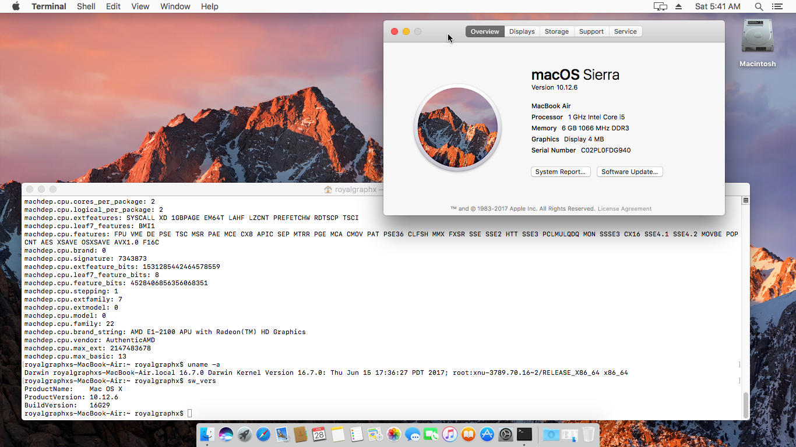
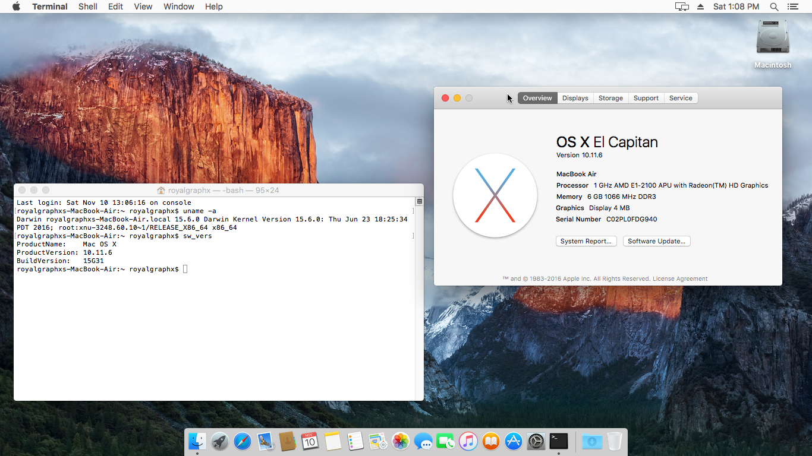
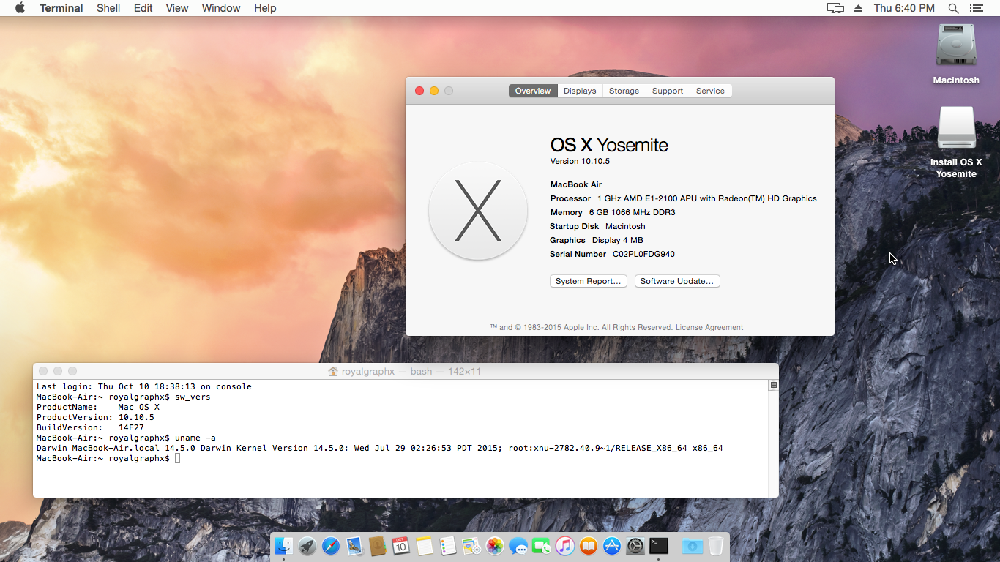
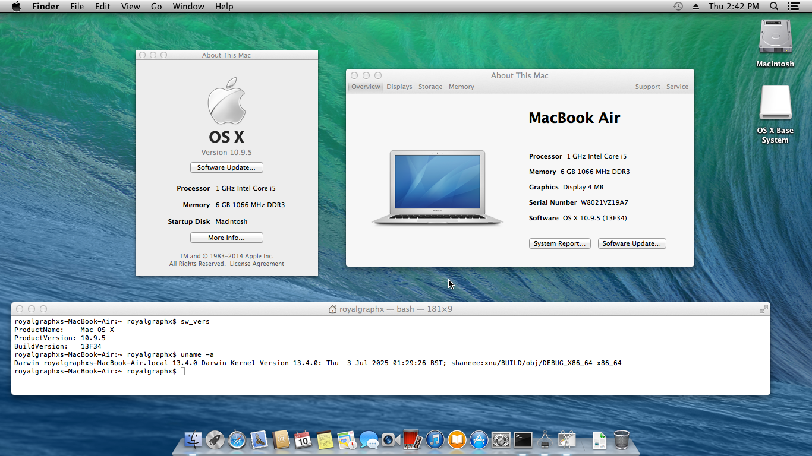

# AMD Kernel Patches for OpenCore
###### Try these patches at your own risk, and always keep an EFI backup.

# Purpose

Binary kernel patches to enable almost native AMD CPU support on OS X.

## Support Chart

| Release Name | Status | Notes |
| --- | --- | --- |
| Sierra | Complete | None |
| El Capitan | Complete  | None |
| Yosemite | Complete | None |
| Mavericks | Work-In-Progress | None |
| Mountain Lion | Incomplete | None |
| Lion | Incomplete | None |
| Snow Leopard | Incomplete | None |
| Leopard | Incomplete | None |
| Tiger | Incomplete | None |

## Gallery

<h3 align="center">macOS Sierra 10.12.6 (16G29)</h3>

  

<h3 align="center">OS X El Capitan 10.11.6 (15G31)</h3>

  

<h3 align="center">OS X Yosemite 10.10.5 (14F27)</h3>

  

<h3 align="center">OS X Mavericks 10.9.5 (13F34)</h3>

  

# Preliminary Information

### Custom OpenCore Requirement

If you want to test these versions of OS X / macOS on your own machine, as of right now you'll be required to use a modified copy of [OpenCore](https://github.com/Carnations-Botanica/OpenCorePkg/actions/runs/15984994642) by Carnations Botanica that has changes to MIN/MAX of default patches that affect AMD CPUs and VMs. These caused the initial early kernel panics in earlier testings.

**You must be signed in to download Github Artifacts like the required <code>macOS XCODE5 Artifacts</code>!**

### OpenCore Quirks

Ensure ``FixupAppleEfiImages`` quirk is enabled to ensure W^R errors on older OS X don't appear.

Ensure the Kernel Quirk `ProvideCurrentCpuInfo` is enabled. OpenCore 0.7.1 or newer is required. You should NOT be using an outdated copy of OpenCore, this requirement has long been deprecated. Make sure to **enable** this quirk or the system **won't boot**. You're only warned once.

### Patch List

Depending on the specific property list you use for your target OS X installation, you can get any of the following 12 patches that are backported from High Sierra:

| Base | Patch Name | Comment |
| --- | --- | --- |
| Strings Replace | GenuineIntel to AuthenticAMD | None |
| _cpuid_set_info | cpuid_cores_per_package set to const | (user-defined) |
| _commpage_populate | Remove rdmsr | None |
| _cpuid_set_cache_info | CPUID 0x8000001d instead of 4 | None |
| _cpuid_set_generic_info | Remove wrmsr(0x8B) | None |
| _cpuid_set_generic_info | Replace rdmsr(0x8B) with constant 186 | None |
| _cpuid_set_generic_info | Set flag=1 | None |
| _cpuid_set_generic_info | Disable check to allow Leaf 7 | None |
| _cpuid_set_cpufamily | Force CPUFAMILY_INTEL_PENRYN | None |
| _mtrr_update_action | Set PAT MSR to 00070106h | None |
| _i386_init/_pstate_trace | Remove rdmsr calls | None |
| _lapic_init | Remove version check panic | None |

### Configuring cpuid_cores_per_package patch.

The Core Count per Package patch needs to be modified to boot your system. The first kernel patch is required to be updated manually according to these instructions no matter what property list you choose. Update the `Replace` value only.

| OS X Version | Default Value | Example Value |
| --- | --- | --- |
| 10.12 | BA 00 00 00 00 00 | BA 02 00 00 00 00 |
| 10.11 | BA 00 00 00 00 00 | BA 04 00 00 00 00 |
| 10.10 | 41 BE 00 00 00 00 | 41 BE 06 00 00 00 |
| 10.9 | TBD | TBD |
| 10.8 | TBD | TBD |
| 10.7 | TBD | TBD |
| 10.6 | TBD | TBD |
| 10.5 | TBD | TBD |
| 10.4 | TBD | TBD |

From the table above, replace `<BX XX>` with the hexadecimal value matching your physical core count. Do not use your CPU's thread count. See the table below for the values matching your CPU core count.

| Core Count | Hexadecimal |
| --- | --- |
| 2 Cores | `02` |
| 4 Cores | `04` |
| 6 Cores | `06` |
| 8 Cores | `08` |
| 12 Cores | `0C` |
| 16 Cores | `10` |
| 24 Cores | `18` |
| 32 Cores | `20` |

## Features

- Leverages OpenCore to run OS X on AMD CPUs without a custom built kernel.

## Disadvantages

- No 32-bit support (OPEMU)

## Supported AMD CPUs

As of right now, these are all theoretically supported AMD CPUs. Testing is greatly appreciated, and opening an Issue on the repo with DEBUG logs is equally appreciated.

| Family | Codename | Product Name |
| --- | --- | --- |
| 17h and 19h | Zen | Ryzen, Threadripper, Athlon 2xxGE |
| 16h | Jaguar | A Series (including AM4 A-Series) |
| 15h | Bulldozer | FX Series |

## AMD Kernel Patches Credits

If any credits are missing, they are to be added in future commits as the project wraps up.

- [RoyalGraphX](https://github.com/RoyalGraphX) for the idea to add support for older OS X releases, main backporting effort such as updating PAT for Sierra, researching cpuid_cores_per_package on older OS X releases, and testing on baremetal machines.

- [Zormeister](https://github.com/zormeister) for the idea to add support for older OS X releases, initial patch matching confirmations for High Sierra -> Sierra backporting effort, cpuid_cores_per_package effort

- [Dhinak G](https://github.com/dhinakg), helping reverse-engineer functions for new Find/Replace values in Tiger, for CPUID 4 and Cores Per Package patches

- [Shaneee](https://github.com/shaneee), helping tackle Snow Leopard Kernel Patches, and assisting in building XNU releases for binary diffing, updating Force PENRYN patches with Masks for wider support

- 

## AMD Vanilla Credits

- [AlGrey](https://github.com/AlGreyy) for the idea and creating the patches.

- [XLNC](https://github.com/XLNCs) for maintaining patches for various macOS versions.

- [Acidanthera](https://github.com/acidanthera) for OpenCore.

- [CaseySJ](https://github.com/CaseySJ/) for Zen 4 IOPCIFamily patches.

- Sinetek, Andy Vandijck, spakk, Bronya, Tora Chi Yo, [Shaneee](https://github.com/Shaneee) and many others for sharing their AMD/XNU kernel knowledge.

<h6 align="center">A big thanks to all contributors and future contributors! ꩓</h6>
